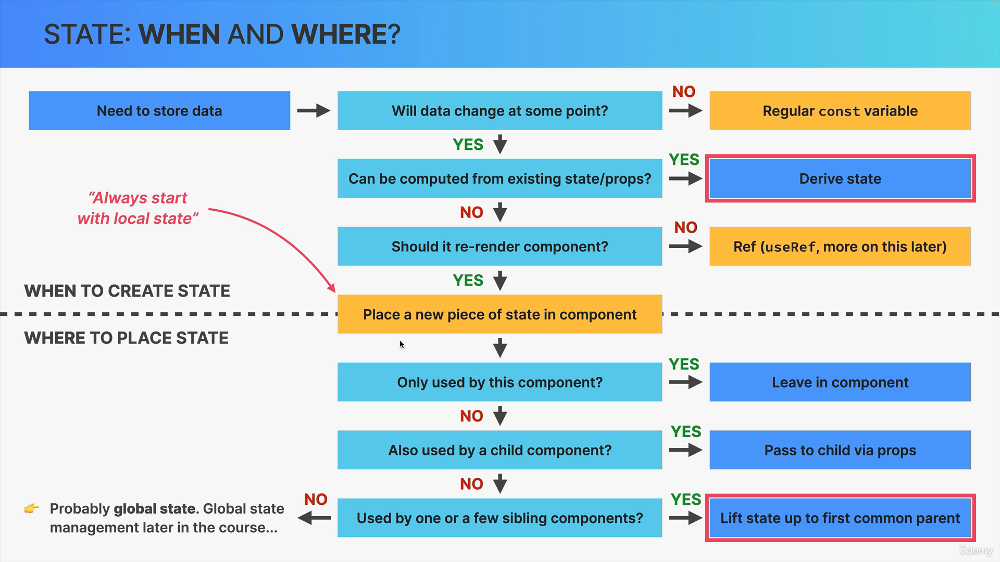

# React

## Qué es React?
React es una biblioteca de JavaScript desarrollada por Facebook. Se utiliza para construir interfaces de usuario, especialmente para aplicaciones de una sola página. Permite a los desarrolladores crear componentes reutilizables de la interfaz de usuario, lo que facilita el desarrollo de aplicaciones complejas.

React es declarativo. En programación, un estilo declarativo se refiere a la programación con "qué" se debe hacer, en lugar de "cómo" se debe hacer. Cuando se programa con React, se define el estado final de la interfaz de usuario en el código, y React se encarga de determinar cómo cambiar la interfaz de usuario para que coincida con ese estado. Esto contrasta con un estilo imperativo, donde el desarrollador tendría que especificar exactamente cómo hacer cada cambio en la interfaz de usuario.


### Características y ventajas de usar React
1. __Component-based:__ React sigue un enfoque basado en componentes. Esto significa que una aplicación React se compone de numerosos componentes independientes, cada uno de los cuales tiene su propia lógica y controles.

2. __State-driven__: Se refiere a cómo el estado de un componente puede controlar cómo se renderiza y se comporta ese componente.

3. __Hooks:__ Los Hooks son una adición reciente a React que permite el uso de estado y otras características de React sin tener que escribir una clase. Esto puede hacer que el código sea más fácil de leer y escribir.

4. __Virtual DOM:__ React utiliza el Virtual DOM, que es una representación ligera del DOM real. Esto permite a React hacer actualizaciones y renderizado de manera eficiente.

5. __JSX:__ React utiliza JSX, una sintaxis que permite HTML y JavaScript coexistir. Esto hace que el código sea más fácil de entender y escribir.

6. __Unidireccionalidad de los datos:__ React sigue un flujo de datos unidireccional. Esto significa que un conjunto de datos inmutables se pasa a los componentes hijos a través de las propiedades. Esto hace que el seguimiento de los cambios y la depuración del código sea más fácil.

7. __Soporte para aplicaciones:__ Con React Native, los desarrolladores pueden usar el mismo estilo de componentes para crear aplicaciones móviles nativas.

8. __Comunidad activa y soporte:__ React tiene una comunidad de desarrolladores muy activa y un fuerte soporte de Facebook. Esto significa que hay una gran cantidad de recursos de aprendizaje disponibles y actualizaciones regulares a la biblioteca.

## Instalar React
Si se desea crear una nueva aplicación o un nuevo sitio web completamente con React, el equipo de React recomienda que se elija uno de los frameworks hechos con React y más populares en la comunidad. Los frameworks brindan funciones que la mayoría de las aplicaciones y los sitios eventualmente necesitan, incluido el enrutamiento, la obtención de datos y la generación de HTML.

### Vite
```
npm create vite@latest
```

### Next.js
```javascript
npx create-next-app@latest
```

### Remix
```javascript
npx create-remix
```

### Gatsby
```javascript
npx create-gatsby
```

# Consideraciones a tener en cuenta para emprezar con React

## "Pensar en React"

Construir aplicaciones de React requiere una nueva mentalidad ya que es simplemente una manera distinta de crear aplicaciones a como se hace utilizando Vanilla JavaScript, por eso, en ordén de crear aplicaciones con React, no solamente debemos aprender a como trabajar como al API de React sino que también debemos ser capaces de "pensar en React".

Pensar en React se refiere a la capacidad de de distinguir __cómo y cuándo__ utilizar todas las herramientas que nos ofrece React (componentes, estado, props, flujo de datos, efectos, etc). También se trata acerca de pensar siempre en términos de "transición de datos" en lugar de mutación de elementos.

Pensar en React se puede definir como un proceso que nos ayuda a estructurar mejor nuestros proyectos siguiendo los siguientes pasos: 
1. Romper la UI en componentes y establecer como estos componentes están relacionado los unos con los otros (árbol de componentes), esto incluye pensar en la reusabilidad y la componibilidad de los componentes.

2. Construir una versión estática de la aplicación (sin ningún estado o interactividad).

3. Pensar acerca del estado (cuándo usarlo, qué tipo de estado [local o global], dónde colocar el estado).

4. Establecer el flujo de los datos (flujo de datos unidireccional, comunicación entre padres e hijos, acceso al estado global).

A los puntos 3 y 4 es lo que se conoce como "manejo del estado" (state management).


## react-dom
react-dom es una biblioteca de React que proporciona métodos específicos del DOM que pueden ser utilizados en el nivel más alto de tu aplicación como una forma de arrancar un árbol de componentes de React en un contenedor del DOM.

El método más comúnmente utilizado en react-dom es ReactDOM.render(), que se utiliza para renderizar un elemento React en un nodo del DOM. Aquí tienes un ejemplo de cómo se utiliza:
```javascript
import React from 'react';
import ReactDOM from 'react-dom';

function App() {
  return <h1>Hola, mundo!</h1>;
}

// Renderiza el componente App en el elemento con id 'root'
ReactDOM.render(<App />, document.getElementById('root'));
```


## StrictMode 
StrictMode es una herramienta para destacar potenciales problemas en una aplicación React. No renderiza ningún contenido visible en la interfaz de usuario y activa comprobaciones y advertencias adicionales solo en el modo de desarrollo.

Se puede habilitar StrictMode para cualquier parte de la aplicación. Por ejemplo, para habilitarlo en toda la aplicación, se puede hacer algo como esto:

```javascript
import React from 'react';

function App() {
  return (
    <React.StrictMode>
      <div>
        {/* El resto de tu aplicación */}
      </div>
    </React.StrictMode>
  );
}

export default App;
```


## Componentes
Un componente en React es una unidad independiente de código que devuelve un elemento React (generalmente representado por JSX) que forma parte de la interfaz de usuario. Los componentes son la base de las aplicaciones React y permiten dividir la interfaz de usuario en piezas reutilizables e independientes.

* Un componente tiene sus propios datos, lógica y apariencia.

* Lo componentes deben retornar un solo bloque de JSX que React utilizará para renderizar te componente dentro de la UI.

#### Propiedades de los componentes:
1. Reutilizables: Los componentes pueden ser reutilizados en diferentes partes de una aplicación. Esto permite un desarrollo más rápido y un código más limpio y mantenible.

2. Componibles: Los componentes pueden ser anidados dentro de otros componentes para construir interfaces de usuario complejas. Esto permite una estructura de aplicación clara y fácil de entender.

3. Estado y Ciclo de Vida: Los componentes en React pueden tener estado interno y métodos de ciclo de vida (en componentes de clase) o hooks (en componentes funcionales) que permiten manejar la lógica de la aplicación de manera efectiva.

4. Props: Los componentes pueden recibir props de sus componentes padres. Esto permite la comunicación entre componentes y hace que los componentes sean configurables para diferentes usos.

5. JSX: Los componentes de React se suelen escribir con JSX, una extensión de sintaxis para JavaScript que permite escribir HTML en tu código JavaScript. Esto hace que los componentes sean más legibles y fáciles de escribir.

6. Virtual DOM: React utiliza el Virtual DOM para hacer que el renderizado de los componentes sea más eficiente. Cuando el estado de un componente cambia, React solo actualiza las partes del DOM real que necesitan ser actualizadas, en lugar de volver a renderizar todo el componente.

7. Unidireccionalidad de los datos: React sigue un patrón de flujo de datos unidireccional. Esto significa que un componente padre pasa las props a los componentes hijos, pero los componentes hijos no pueden modificar directamente las props que reciben. Esto hace que el flujo de datos sea más predecible y fácil de rastrear.


## JSX
JSX (JavaScript XML) es una extensión de sintaxis para JavaScript que se utiliza comúnmente en React para describir cómo debería ser la interfaz de usuario. Permite escribir HTML en el código JavaScript, lo que hace que el código sea más legible y fácil de entender.

Es un sintaxis declarativa que describe como se verán los componentes y como funcionarán basado en su lógica y datos. Al decir que es una sintaxis declarativa se refiera a que usamos JSX para decirle a React como queremos que se vea la UI pero no como hacerlo paso a paso ya que React puede resolverlo por sí mismo.


### Reglas generales de JSX
1. JSX funciona escencialmente como HTML, pero podemos entrar en "modo JavaScript" usando {}.
2. Dentro de {} podemos utilizar expresiones de JavaScript como por ejemplo: referenciar variables, crear arrays u objetos y utilizar sus respectivos métodos, operadores ternarios, etc. 
3. Lo que no se puede usar dentro de {} son declaraciones de JavaScript como if/else, for, switch, etc.
4. Lo más importante de entender es que JSX produce una expresión de JsvaScript, o entroas palabras, JSX is justamente como cualquier otra expresión de JavaScript.
5. Esto tiene sentido ya que JSX es simplemete convertido a una llamada a la función "create-element", que es de hecho una expresión. esto tiene dos implicaciones:
    1. Podemos colocar otras piezas de JSX dentro {}.
    2. Podemos escribir JSX en cualquier lugar dentro de un componente.
6. Una pieza de JSX puede retornar solamente un elemento de un componente, si se necesita retornar más de uno se debe usar `<React.Fragment>` o fragmento.

> La principal diferencia expresiones y declaraciones es que una expresión produce un valor y puede ser utilizada en lugares donde se espera un valor, mientras que una declaración realiza una acción y no produce un valor directamente.

#### Diferencia entre JSX y HTML
1. Se debe usar `className` en lugar de `class`.
2. Cada tag debe ser cerrado siempre. Por ejemplo `` o `<br />`.
3. Todos los controladores de eventos y otras propiedes deben ser escritas en **camelCase**. Por ejemplo `onClick` o `onMouseOver`. Con excepción de `aria-*` y `data-*` que son escritos con guiones como en HTML.
4. El CSS en línea debe ser escrito así: ``.
5. Las propiedades de CSS también deben ser escritas en camelCase.
6. Los comentarios deben ir dentro de {} ya que tambien son JavaScript.


## Props
Los props (abreviatura de propiedades) en React son la forma de pasar datos de los componentes padres a los componentes hijos. Son similares a los argumentos de una función en JavaScript puro.

Los props son inmutables, lo que significa que un componente hijo no puede modificar los props que recibe de su componente padre. Esto es importante para mantener un flujo de datos unidireccional y predecible en tu aplicación.

* Ejemplo de un prop:
```javascript
function Saludo(props) {
  return <h1>Hola, {props.nombre}</h1>;
}

// Uso del componente
<Saludo nombre="Mundo" />
```

Además de los datos, también se puede pasar funciones como props para permitir la comunicación de los componentes hijos con los componentes padres. Esto es útil para cosas como manejar eventos de usuario.


## Fragments
Un Fragment en React es un tipo de componente que permite agrupar una lista de hijos sin agregar nodos extra al DOM.

Cuando se renderiza múltiples elementos a la vez, normalmente los se envuelve en un contenedor div. Pero a veces, envolver elementos en un div puede arruinar la semántica del HTML, especialmente en situaciones donde los elementos deben ser hijos directos de un elemento específico, como en una lista (`<ul>` o `<ol>`).

Aquí es donde los Fragments son útiles. Se puede envolver múltiples elementos en un Fragment y React no agregará un nodo extra al DOM.

```javascript
import React, { Fragment } from 'react';

function MiComponente() {
  return (
    <Fragment>
      <h1>Mi título</h1>
      <p>Mi párrafo</p>
    </Fragment>
  );
}
```

También se puede usar una sintaxis más corta para los Fragments, que es simplemente <> y </>:
```javascript
function MiComponente() {
  return (
    <>
      <h1>Mi título</h1>
      <p>Mi párrafo</p>
    </>
  );
}
```


## Manejar eventos en React
Manejar eventos en React es muy similar a manejar eventos en el DOM. Sin embargo, hay algunas diferencias de sintaxis:

1. Los nombres de los eventos son camelCase en lugar de minúsculas.
2. Con JSX se pasa una función como el manejador del evento, en lugar de un string.

Ejemplo: 
```javascript
function MiComponente() {
  function handleClick() {
    alert('Botón clickeado!');
  }

  return (
    <button onClick={handleClick}>
      Haz clic aquí
    </button>
  );
}
```

En este ejemplo, onClick es el evento que estamos manejando, y handleClick es la función que se ejecutará cuando se haga clic en el botón.

__Algunas cosas importantes a tener en cuenta al manejar eventos en React son:__

1. No se debe llamar a la función al pasarla al manejador del evento. En el ejemplo anterior, pasamos handleClick, no handleClick(). Si se hace, la función se ejecutará cada vez que se renderice el componente, no cuando se haga clic en el botón.

2. El valor de `this` en los manejadores de eventos es undefined en las clases de JavaScript. Esto es diferente a cómo funcionan los manejadores de eventos en el DOM. Si se necesita acceder a `this` en un manejador de eventos en un componente de clase, se necesitará vincular la función o usar una función de flecha.

3. Los eventos en React están "sintetizados". Esto significa que React no pasa el evento del DOM real a la función de manejo de eventos. En su lugar, pasa un objeto `SyntheticEvent` que se comporta de la misma manera que el evento del DOM. Esto se hace por razones de rendimiento y compatibilidad entre navegadores.

### Eventos que soporta React
1. __Eventos del ratón:__ onClick, onDoubleClick, onMouseDown, onMouseMove, onMouseUp, onMouseEnter, onMouseLeave, onMouseOver, onMouseOut.

2. __Eventos del teclado:__ onKeyDown, onKeyPress, onKeyUp.

3. __Eventos de formulario:__ onChange, onSubmit, onFocus, onBlur, onSelect.

4. __Eventos de UI:__ onScroll, onWheel.

5. __Eventos de arrastrar y soltar:__ onDrag, onDragEnd, onDragEnter, onDragExit, onDragLeave, onDragOver, onDragStart, onDrop.

6. __Eventos de imagen:__ onLoad, onError.

7. __Eventos de animación:__ onAnimationStart, onAnimationEnd, onAnimationIteration.

8. __Eventos de transición:__ onTransitionEnd.

Todos estos eventos se manejan de manera similar en React. Se pasan como props a los componentos y se les asigna una función que se ejecutará cuando ocurra el evento. 


## Hooks

Los Hooks son una característica introducida en React 16.8 que permite usar el estado y otras características de React sin escribir una clase. Los Hooks son funciones que permiten "enganchar" el estado de React y el ciclo de vida desde componentes funcionales.

Los Hooks más comunes son `useState` y `useEffect`.

1. `useState`: Este Hook te permite agregar estado a los componentes funcionales. Devuelve un par: el valor del estado actual y una función que te permite actualizarlo.
```javascript
const [contador, setContador] = useState(0);
```

2. `useEffect`: Este Hook te permite realizar efectos secundarios en los componentes funcionales. Se puedes pensar en useEffect Hook como componentDidMount, componentDidUpdate, y componentWillUnmount combinados.
```javascript
useEffect(() => {
  document.title = `Has hecho clic ${contador} veces`;
}, [contador]); // Solo se vuelve a ejecutar si `contador` cambia
```

Existen otros Hooks como useContext, useReducer, useCallback, useMemo, useRef, etc. Además, se puede crear tus propios Hooks personalizados para reutilizar la lógica del estado entre diferentes componentes.

# State o Estado

El "state" o estado en React es un objeto que almacena los valores que pueden cambiar a lo largo del tiempo y que pueden afectar el renderizado del componente. Cada componente puede tener su propio estado y este estado puede ser pasado como props a los componentos hijos.

El estado se inicializa en el constructor de un componente de clase o utilizando el Hook useState en un componente funcional.

Ejemplo de cómo se utiliza el estado en un componente de clase:

```javascript 
class MiComponente extends React.Component {
  constructor(props) {
    super(props);
    this.state = { contador: 0 };
  }

  render() {
    return (
      <div>
        <p>Has hecho clic {this.state.contador} veces</p>
        <button onClick={() => this.setState({ contador: this.state.contador + 1 })}>
          Haz clic en mí
        </button>
      </div>
    );
  }
}
```

Ejemplo de cómo se utiliza el estado en un componente funcional con el Hook useState:
```javascript
import React, { useState } from 'react';

function MiComponente() {
  const [contador, setContador] = useState(0);

  return (
    <div>
      <p>Has hecho clic {contador} veces</p>
      <button onClick={() => setContador(contador + 1)}>
        Haz clic en mí
      </button>
    </div>
  );
}
```

En ambos ejemplos, el estado se utiliza para almacenar el número de veces que se ha hecho clic en un botón. Cada vez que se hace clic en el botón, se actualiza el estado, lo que provoca que el componente se vuelva a renderizar con el nuevo valor del contador.

El estado en React es una característica muy importante que permite a los componentes ser dinámicos y reactivos a los cambios de datos. Aquí hay algunos puntos adicionales sobre el estado en React:

1. __El estado es local y encapsulado:__ El estado definido en un componente no es accesible directamente desde otros componentos a menos que se pase explícitamente como props.

2. __Las actualizaciones de estado pueden ser asincrónicas:__ React puede agrupar varias llamadas a setState en un solo cambio para mejorar el rendimiento. Por lo tanto, no se debe confiar en los valores actuales del estado para calcular el próximo estado. En su lugar, se puede usar una forma alternativa de setState que acepta una función en lugar de un objeto.

3. __Las actualizaciones de estado provocan un nuevo renderizado:__ Cuando el estado de un componente cambia, React re-renderiza ese componente y todos los componentes hijos. Sin embargo, esto no significa que el DOM se actualice para cada cambio de estado. React utiliza un algoritmo de reconciliación para determinar qué cambios en el DOM son necesarios para reflejar el nuevo estado.

4. __Nunca se debe modificar el estado directamente__ (excepto en el constructor de un componente de clase). En su lugar, debes usar setState en componentes de clase o el setter devuelto por useState en componentes funcionales.

5. __El estado puede contener cualquier tipo de datos:__ números, cadenas, arrays, objetos, booleanos, etc. Sin embargo, en los componentes de clase, el estado debe ser un objeto.

6. __Los componentes sin estado son más fáciles de probar y entender:__ Los componentes sin estado son componentes que no tienen su propio estado. Reciben todos sus datos a través de props. Estos componentes son más fáciles de probar y entender porque su salida depende únicamente de sus props y no de algún estado interno.

7. El estado inicial se especifica con un prop especial llamado defaultProps en componentes de clase o dentro de la función useState en componentes funcionales.


## Estado vs. Props
`Estado`: Son datos internos, que son propiedad del componente en el que se declara, al estado se puede considerar como la memoria del componente, ya que puede mantener los datos a lo largo del tiempo,es decir, a través de múltiples re-renderizaciones. El estado puede ser actualizado por el propio componente y esto hará que el componente sea re-renderizado por React. Por lo tanto, utilizamos este mecanismo de estado para que los componentes sean interactivos.

`Props`: Son datos externos, que son propiedad del componente padre, y se puede pensar en ellos como parámetro de la función. Como un canal de comunicación entre componentes padres e hijos donde los padres pueden pasar datos a los hijos. Son solo de lectura, por lo que no pueden ser modificados por el componente que los recibe, sin embargo, cuando el componente hijo recibe nuevos props actualizados, hará que el componente vuelva a renderizar. Los props son utilizados para dar al componente padre la habilidad de configurar sus componentes hijos.

Cuando quiera que un pedazo de estado es pasado como prop, cuando ese estado se actualice, los dos componentes son re-renderizados, así que, tanto el componente dueño del estado como el componente que recibe el estado como prop se re-renderizan. Esta es un conexión enter estado y props que siempre se debe tener en cuenta.


## Manejo del estado (State management)
El manejo del estado en React se refiere a la forma en que se almacenan, se modifican y se utilizan los datos en una aplicación. En React, el estado es un objeto que almacena los valores que pueden cambiar con el tiempo y que pueden afectar el renderizado del componente.

Es decidir cuándo necesitamos crear un estado, qué tipo de estado necesitamos, dónde colocar cada estado dentro de nuestro código base, y también, cómo todos los datos deben fluir a través de la aplicación.


### Estado local vs. Estado global

#### Estado local:
1. Es un estado que es necesitado solamente por uno o pocos componentes como los componentes hijos o hermanos.
2. Creamos el estado local simplemente usando la función `useState` dentro de cierto componente. Ese estado es unicamente accesible para ese componente y a sus componentes hijos si lo pasamos a través de props.


#### Estado global:
1. También conocido como "estado compartido", es un estado que muchos componentes pueden llegar a necesitarlo.
2. Este estado puede ser accesible para todos los componentes en toda la aplicación.
3. Podemos definir el estado global utilizando `Context API` que nos ofrece React o podemos utilizar una librería externa de manejo del estado global como `Redux`.

### Cómo y Cuándo utilizar el estado



## "Lift State Up"
"Lift State Up" es un patrón común en React que se utiliza cuando varios componentes necesitan compartir y manipular los mismos datos. En lugar de duplicar el estado en varios componentes, el estado se "eleva" al componente padre más cercano que necesita los datos. Luego, el estado se pasa a los componentes hijos como props.

Este patrón es útil porque mantiene el estado en un solo lugar, lo que facilita la depuración y evita problemas de sincronización de estado. Sin embargo, puede hacer que los componentes superiores se vuelvan demasiado complejos si manejan demasiado estado. En esos casos, podrías considerar usar una biblioteca de manejo de estado como Redux o Context API.


## "Child-to-Parent Communication"
La comunicación de hijo a padre en React se refiere a la forma en que un componente hijo puede enviar datos de vuelta a su componente padre. Esto se hace generalmente a través de funciones.

En React, los datos fluyen de arriba hacia abajo (del padre al hijo) a través de las props. Sin embargo, si un componente hijo necesita enviar datos al padre, el componente padre puede pasar una función al hijo a través de las props. Luego, el componente hijo puede llamar a esta función y pasarle los datos que necesita enviar al padre.


## Derived State
El estado derivado en React se refiere a la práctica de derivar el estado de un componente a partir de los cambios en las props. Esto es útil cuando se necesita sincronizar algunos de los estados de un componente con los cambios en las props.

Es importante tener en cuenta que el estado derivado puede hacer que el componente sea más difícil de entender y mantener, ya que introduce una fuente adicional de verdad. En general, es mejor evitar el estado derivado si se puede calcular los valores que se necesitan durante el renderizado, o si se puede mantener los datos sincronizados utilizando el ciclo de vida del componente o los efectos.


## Elementos controlados(Controlled Elements)
Los elementos controlados en React son elementos de formulario como `<input>`, `<textarea>` y `<select>` cuyo valor es controlado por el estado del componente de React. En lugar de permitir que el DOM maneje el estado del formulario, los elementos controlados tienen su estado manejado por un componente de React.

Los elementos controlados son útiles porque permiten validar o manipular los datos del usuario antes de que se guarden en el estado. También facilitan la pre-población de los campos de entrada con valores predeterminados o existentes.

Ejemplo de un elemento controlado en React:
```javascript
import React, { useState } from 'react';

function MiFormulario() {
  const [nombre, setNombre] = useState('');

  const manejarCambio = (evento) => {
    setNombre(evento.target.value);
  };

  return (
    <form>
      <label>
        Nombre:
        <input type="text" value={nombre} onChange={manejarCambio} />
      </label>
      <input type="submit" value="Enviar" />
    </form>
  );
}
```

Aquí hay algunos puntos adicionales que se debe saber sobre los elementos controlados en React:

1. __Manejo de eventos:__ En los elementos controlados, el manejo de eventos se realiza en el código de React. Por ejemplo, cada vez que el estado de un campo de entrada cambia, se llama a una función manejadora de eventos que actualiza el estado del componente.

2. __Valor de los elementos:__ En los elementos controlados, el valor de los elementos del formulario se deriva del estado del componente. Esto significa que puedes acceder y modificar el valor de un elemento de formulario en cualquier momento, simplemente actualizando el estado del componente.

3. __Validación de formularios:__ Los elementos controlados facilitan la validación de los datos del formulario antes de que se envíen. Puedes verificar el estado del componente en cualquier momento para asegurarte de que los datos del formulario cumplen con tus requisitos antes de permitir que el usuario envíe el formulario.

4. __Formularios prellenados:__ Los elementos controlados facilitan la creación de formularios prellenados. Simplemente establece el estado inicial del componente a los datos prellenados.

5. __Integración con otras bibliotecas de UI:__ Algunas bibliotecas de UI requieren que los elementos del formulario sean controlados. Esto es porque necesitan un control preciso sobre el valor y el manejo de eventos de los elementos del formulario.

6. __Rendimiento:__ En formularios muy grandes, los elementos controlados pueden ser menos eficientes que los elementos no controlados, ya que cada cambio de estado provoca un re-renderizado del componente. Sin embargo, en la mayoría de los casos, la diferencia de rendimiento es insignificante.

