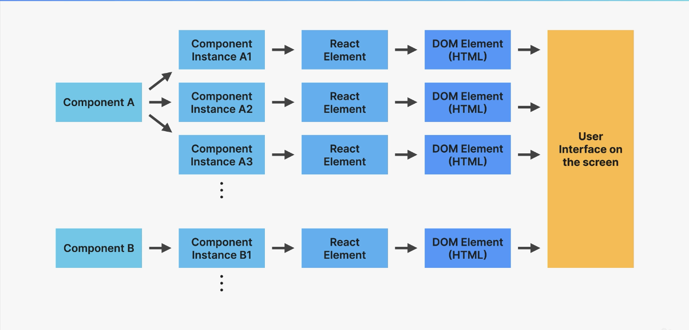
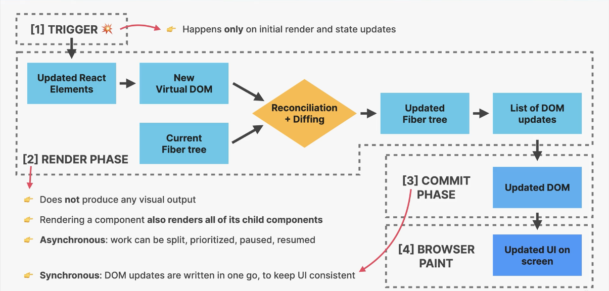

# React

## Qué es React?
React es una biblioteca de JavaScript desarrollada por Facebook. Se utiliza para construir interfaces de usuario, especialmente para aplicaciones de una sola página. Permite a los desarrolladores crear componentes reutilizables de la interfaz de usuario, lo que facilita el desarrollo de aplicaciones complejas.

React es declarativo. En programación, un estilo declarativo se refiere a la programación con "qué" se debe hacer, en lugar de "cómo" se debe hacer. Cuando se programa con React, se define el estado final de la interfaz de usuario en el código, y React se encarga de determinar cómo cambiar la interfaz de usuario para que coincida con ese estado. Esto contrasta con un estilo imperativo, donde el desarrollador tendría que especificar exactamente cómo hacer cada cambio en la interfaz de usuario.


### Características y ventajas de usar React
1. __Component-based:__ React sigue un enfoque basado en componentes. Esto significa que una aplicación React se compone de numerosos componentes independientes, cada uno de los cuales tiene su propia lógica y controles.

2. __State-driven__: Se refiere a cómo el estado de un componente puede controlar cómo se renderiza y se comporta ese componente.

3. __Hooks:__ Los Hooks son una adición reciente a React que permite el uso de estado y otras características de React sin tener que escribir una clase. Esto puede hacer que el código sea más fácil de leer y escribir.

4. __Virtual DOM:__ React utiliza el Virtual DOM, que es una representación ligera del DOM real. Esto permite a React hacer actualizaciones y renderizado de manera eficiente.

5. __JSX:__ React utiliza JSX, una sintaxis que permite HTML y JavaScript coexistir. Esto hace que el código sea más fácil de entender y escribir.

6. __Unidireccionalidad de los datos:__ React sigue un flujo de datos unidireccional. Esto significa que un conjunto de datos inmutables se pasa a los componentes hijos a través de las propiedades. Esto hace que el seguimiento de los cambios y la depuración del código sea más fácil.

7. __Soporte para aplicaciones:__ Con React Native, los desarrolladores pueden usar el mismo estilo de componentes para crear aplicaciones móviles nativas.

8. __Comunidad activa y soporte:__ React tiene una comunidad de desarrolladores muy activa y un fuerte soporte de Facebook. Esto significa que hay una gran cantidad de recursos de aprendizaje disponibles y actualizaciones regulares a la biblioteca.

## Instalar React
Si se desea crear una nueva aplicación o un nuevo sitio web completamente con React, el equipo de React recomienda que se elija uno de los frameworks hechos con React y más populares en la comunidad. Los frameworks brindan funciones que la mayoría de las aplicaciones y los sitios eventualmente necesitan, incluido el enrutamiento, la obtención de datos y la generación de HTML.

### Vite
```
npm create vite@latest
```

### Next.js
```javascript
npx create-next-app@latest
```

### Remix
```javascript
npx create-remix
```

### Gatsby
```javascript
npx create-gatsby
```

# Consideraciones a tener en cuenta para emprezar con React

## "Pensar en React"

Construir aplicaciones de React requiere una nueva mentalidad ya que es simplemente una manera distinta de crear aplicaciones a como se hace utilizando Vanilla JavaScript, por eso, en ordén de crear aplicaciones con React, no solamente debemos aprender a como trabajar como al API de React sino que también debemos ser capaces de "pensar en React".

Pensar en React se refiere a la capacidad de de distinguir __cómo y cuándo__ utilizar todas las herramientas que nos ofrece React (componentes, estado, props, flujo de datos, efectos, etc). También se trata acerca de pensar siempre en términos de "transición de datos" en lugar de mutación de elementos.

Pensar en React se puede definir como un proceso que nos ayuda a estructurar mejor nuestros proyectos siguiendo los siguientes pasos: 
1. Romper la UI en componentes y establecer como estos componentes están relacionado los unos con los otros (árbol de componentes), esto incluye pensar en la reusabilidad y la componibilidad de los componentes.

2. Construir una versión estática de la aplicación (sin ningún estado o interactividad).

3. Pensar acerca del estado (cuándo usarlo, qué tipo de estado [local o global], dónde colocar el estado).

4. Establecer el flujo de los datos (flujo de datos unidireccional, comunicación entre padres e hijos, acceso al estado global).

A los puntos 3 y 4 es lo que se conoce como "manejo del estado" (state management).


## react-dom
react-dom es una biblioteca de React que proporciona métodos específicos del DOM que pueden ser utilizados en el nivel más alto de tu aplicación como una forma de arrancar un árbol de componentes de React en un contenedor del DOM.

El método más comúnmente utilizado en react-dom es ReactDOM.render(), que se utiliza para renderizar un elemento React en un nodo del DOM. Aquí tienes un ejemplo de cómo se utiliza:
```javascript
import React from 'react';
import ReactDOM from 'react-dom';

function App() {
  return <h1>Hola, mundo!</h1>;
}

// Renderiza el componente App en el elemento con id 'root'
ReactDOM.render(<App />, document.getElementById('root'));
```


## StrictMode 
StrictMode es una herramienta para destacar potenciales problemas en una aplicación React. No renderiza ningún contenido visible en la interfaz de usuario y activa comprobaciones y advertencias adicionales solo en el modo de desarrollo.

Se puede habilitar StrictMode para cualquier parte de la aplicación. Por ejemplo, para habilitarlo en toda la aplicación, se puede hacer algo como esto:

```javascript
import React from 'react';

function App() {
  return (
    <React.StrictMode>
      <div>
        {/* El resto de tu aplicación */}
      </div>
    </React.StrictMode>
  );
}

export default App;
```


## Componentes
Un componente en React es una unidad independiente de código que devuelve un elemento React (generalmente representado por JSX) que forma parte de la interfaz de usuario. Los componentes son la base de las aplicaciones React y permiten dividir la interfaz de usuario en piezas reutilizables e independientes.

* Un componente tiene sus propios datos, lógica y apariencia.

* Lo componentes deben retornar un solo bloque de JSX que React utilizará para renderizar te componente dentro de la UI.

> La instancia de un componente es creada cuando usamos un componente, React internamente hará la llamada a "MiComponente()", se puede decir que es la manifestación "física" de un componente y tiene su propio estado y props. La instancia de un componente tiene un ciclo de vida(puede "nacer", "vivir" y "morir").

> Los conceptos de Componente e Instancia de componente suele ser usados indistintamente. Por ejemplo, se dice que una UI esta compuesta por componentes y no por instancias de componentes, que sería realmente de lo que está compuesto.

> JSX es convertido en una función React.createElement(). Un Elemento React es el resultado de la llamada de esa función. En palabras simples es un objeto JavaScript inmutable que React mantiene en memoria. Un Elemento React básicamente contiene toda la información que es necesaria en orden de crear elementos en el DOM para la instancia del componente actual. Este Elemento React eventualmente será convertido a un elemento del DOM, y pintado en pantalla por el navegador.

#### Propiedades de los componentes:
1. Reutilizables: Los componentes pueden ser reutilizados en diferentes partes de una aplicación. Esto permite un desarrollo más rápido y un código más limpio y mantenible.

2. Componibles: Los componentes pueden ser anidados dentro de otros componentes para construir interfaces de usuario complejas. Esto permite una estructura de aplicación clara y fácil de entender.

3. Estado y Ciclo de Vida: Los componentes en React pueden tener estado interno y métodos de ciclo de vida (en componentes de clase) o hooks (en componentes funcionales) que permiten manejar la lógica de la aplicación de manera efectiva.

4. Props: Los componentes pueden recibir props de sus componentes padres. Esto permite la comunicación entre componentes y hace que los componentes sean configurables para diferentes usos.

5. JSX: Los componentes de React se suelen escribir con JSX, una extensión de sintaxis para JavaScript que permite escribir HTML en tu código JavaScript. Esto hace que los componentes sean más legibles y fáciles de escribir.

6. Virtual DOM: React utiliza el Virtual DOM para hacer que el renderizado de los componentes sea más eficiente. Cuando el estado de un componente cambia, React solo actualiza las partes del DOM real que necesitan ser actualizadas, en lugar de volver a renderizar todo el componente.

7. Unidireccionalidad de los datos: React sigue un patrón de flujo de datos unidireccional. Esto significa que un componente padre pasa las props a los componentes hijos, pero los componentes hijos no pueden modificar directamente las props que reciben. Esto hace que el flujo de datos sea más predecible y fácil de rastrear.


## JSX
JSX (JavaScript XML) es una extensión de sintaxis para JavaScript que se utiliza comúnmente en React para describir cómo debería ser la interfaz de usuario. Permite escribir HTML en el código JavaScript, lo que hace que el código sea más legible y fácil de entender.

Es un sintaxis declarativa que describe como se verán los componentes y como funcionarán basado en su lógica y datos. Al decir que es una sintaxis declarativa se refiera a que usamos JSX para decirle a React como queremos que se vea la UI pero no como hacerlo paso a paso ya que React puede resolverlo por sí mismo.


### Reglas generales de JSX
1. JSX funciona escencialmente como HTML, pero podemos entrar en "modo JavaScript" usando {}.
2. Dentro de {} podemos utilizar expresiones de JavaScript como por ejemplo: referenciar variables, crear arrays u objetos y utilizar sus respectivos métodos, operadores ternarios, etc. 
3. Lo que no se puede usar dentro de {} son declaraciones de JavaScript como if/else, for, switch, etc.
4. Lo más importante de entender es que JSX produce una expresión de JsvaScript, o entroas palabras, JSX is justamente como cualquier otra expresión de JavaScript.
5. Esto tiene sentido ya que JSX es simplemete convertido a una llamada a la función "create-element", que es de hecho una expresión. esto tiene dos implicaciones:
    1. Podemos colocar otras piezas de JSX dentro {}.
    2. Podemos escribir JSX en cualquier lugar dentro de un componente.
6. Una pieza de JSX puede retornar solamente un elemento de un componente, si se necesita retornar más de uno se debe usar `<React.Fragment>` o fragmento.

> La principal diferencia expresiones y declaraciones es que una expresión produce un valor y puede ser utilizada en lugares donde se espera un valor, mientras que una declaración realiza una acción y no produce un valor directamente.

#### Diferencia entre JSX y HTML
1. Se debe usar `className` en lugar de `class`.
2. Cada tag debe ser cerrado siempre. Por ejemplo `` o `<br />`.
3. Todos los controladores de eventos y otras propiedes deben ser escritas en **camelCase**. Por ejemplo `onClick` o `onMouseOver`. Con excepción de `aria-*` y `data-*` que son escritos con guiones como en HTML.
4. El CSS en línea debe ser escrito así: ``.
5. Las propiedades de CSS también deben ser escritas en camelCase.
6. Los comentarios deben ir dentro de {} ya que tambien son JavaScript.


## Cómo funciona el renderiazado en react
Mientras contruimos una aplicación React, lo que realmente se hace es construir componentes, luego podemos usar esos componentes dentro de otros componentes tantas veces como deseemos lo que hará que React cree uno o más instancias de componente de cada componente.

Mientras React llama cada instancia de componente, cada JSX producirá varias llamadas de función de React.createElement() que dará como resultado un Elemento React por cada Instancia de Componente. Y finalmente, estos Elementos React serán transformados en Elementos del DOM y mostrados en pantalla como la interfaz de usuario.



> Es importante notar que en React, el "renderizado" no significa necesariamente actualizar el DOM o mostrar elementos en la pantalla. El renderizado ocurre internamente en React, y no produce cambios visuales por sí mismo. Los cambios visuales ocurren cuando React actualiza el DOM basado en los resultados del renderizado.

### Fases del renderizado
1. `Fase de Desencadenamiento del renderizado:` Hay dos maneras de activar el renderizado, la primera se produce la primera vez que la aplicación se ejecuta y es conocido como el renderizado inicial, y la segunda es cuando ocurre un actualización de estado en uno mas más instancia de componente en algún lugar de la aplicación y es lo que llamamos en re-renderizado.

> El proceso de renderizado es activado for la aplicación entera y no solo por un único componente.

2. `Fase de Renderizado:` Después de activar un renderizado, React llama a los componentes para averiguar qué mostrar en la pantalla. Un «renderizado» consiste en que React haga una llamada a los componentes. React llamará al componente de función cuya actualización de estado desencadenó el renderizado. Durante un rerenderizado, React calculará cuáles de sus propiedades, si es que hay alguna, han cambiado desde el renderizado anterior. No hará nada con esa información hasta el siguiente paso, la fase de confirmación.

> Este proceso es recursivo: si el componente actualizado devuelve algún otro componente, React renderizará ese componente a continuación, y si ese componente también devuelve algo, renderizará ese componente a continuación, y así sucesivamente. El proceso continuará hasta que no haya más componentes anidados y React sepa exactamente qué debe mostrarse en pantalla.

3. `Fase de Confirmación:` Después de renderizar (llamar) los componentes, React modificará el DOM insertando, eliminando y actualizando elementos. La fase de confirmación es sincrónica, lo que significa que no puede ser interrumpida, esto es necesario para que el DOM nunca muestre resultados parciales, asegurando la consistencia de la UI. 

> Esta fase no es realizada por React, sino por una librería aparte llamada ReactDOM. La fase de confirmación se hace a través de los "renderers" (ReactDOM, React Navtive, Remotion, etc) que son utilizados para pintar los componentes. 

4. `Pintado en el navegador:` El navegador se dará cuenta que el DOM ha sido cambiado, y como resultado, repintará la UI. Aquí es donde las actualizaciones del DOM son finalmente visibles al usuario en forma de una actualización de la UI.

> React no toca el DOM si el resultado del renderizado es el mismo que la última vez



### Reconciliación
La reconciliación en React es el proceso por el cual React actualiza el DOM. Cuando el estado de un componente cambia, React necesita determinar cómo actualizar la interfaz de usuario para reflejar ese cambio. Esto se hace a través del proceso de reconciliación. Los pasos básicos de la reconciliación son:

1. Cuando se produce un cambio en el estado o las props de un componente, React genera un nuevo árbol de elementos React.

2. React compara este nuevo árbro con el árbol anterior (el árbol actualmente en el DOM)

3. React calcula la "diferencia mínima" entre los dos árboles (esto se conoce como "diffing").

4. React realiza las actualizaciones mínimas necesarias en el DOM para llevar el DOM al estado representado por el nuevo árbol de elementos.


### Diffing 
El "Diffing" es el proceso que React utiliza para comparar el árbol de elementos actual con el nuevo árbol de elementos cuando se produce una actualización. Este proceso permite a React determinar qué partes del DOM necesitan ser actualizadas, lo que resulta en una actualización más eficiente del DOM. React realiza el "Diffing" en dos pasos:

1. `Diffing de elementos:` React primero compara dos elementos del mismo nivel en el árbol. Si los elementos son de diferentes tipos, React asume que la estructura del árbol ha cambiado significativamente y procede a reconstruir el árbol desde ese punto. Si los elementos son del mismo tipo, React mantiene el mismo nodo del DOM y solo actualiza las propiedades cambiadas.

2. `Diffing de componentes:` Si los elementos son componentes, React llama al método render del componente para obtener el nuevo árbol de elementos. Luego, compara el nuevo árbol de elementos con el antiguo para determinar las actualizaciones necesarias.

> Este proceso de "Diffing" permite a React realizar actualizaciones mínimas al DOM, lo que mejora el rendimiento de la aplicación.

## Props
Los props (abreviatura de propiedades) en React son la forma de pasar datos de los componentes padres a los componentes hijos. Son similares a los argumentos de una función en JavaScript puro.

Los props son inmutables, lo que significa que un componente hijo no puede modificar los props que recibe de su componente padre. Esto es importante para mantener un flujo de datos unidireccional y predecible en tu aplicación.

* Ejemplo de un prop:
```javascript
function Saludo(props) {
  return <h1>Hola, {props.nombre}</h1>;
}

// Uso del componente
<Saludo nombre="Mundo" />
```

Además de los datos, también se puede pasar funciones como props para permitir la comunicación de los componentes hijos con los componentes padres. Esto es útil para cosas como manejar eventos de usuario.


## Fragments
Un Fragment en React es un tipo de componente que permite agrupar una lista de hijos sin agregar nodos extra al DOM.

Cuando se renderiza múltiples elementos a la vez, normalmente los se envuelve en un contenedor div. Pero a veces, envolver elementos en un div puede arruinar la semántica del HTML, especialmente en situaciones donde los elementos deben ser hijos directos de un elemento específico, como en una lista (`<ul>` o `<ol>`).

Aquí es donde los Fragments son útiles. Se puede envolver múltiples elementos en un Fragment y React no agregará un nodo extra al DOM.

```javascript
import React, { Fragment } from 'react';

function MiComponente() {
  return (
    <Fragment>
      <h1>Mi título</h1>
      <p>Mi párrafo</p>
    </Fragment>
  );
}
```

También se puede usar una sintaxis más corta para los Fragments, que es simplemente <> y </>:
```javascript
function MiComponente() {
  return (
    <>
      <h1>Mi título</h1>
      <p>Mi párrafo</p>
    </>
  );
}
```


## Manejar eventos en React
Manejar eventos en React es muy similar a manejar eventos en el DOM. Sin embargo, hay algunas diferencias de sintaxis:

1. Los nombres de los eventos son camelCase en lugar de minúsculas.
2. Con JSX se pasa una función como el manejador del evento, en lugar de un string.

Ejemplo: 
```javascript
function MiComponente() {
  function handleClick() {
    alert('Botón clickeado!');
  }

  return (
    <button onClick={handleClick}>
      Haz clic aquí
    </button>
  );
}
```

En este ejemplo, onClick es el evento que estamos manejando, y handleClick es la función que se ejecutará cuando se haga clic en el botón.

__Algunas cosas importantes a tener en cuenta al manejar eventos en React son:__

1. No se debe llamar a la función al pasarla al manejador del evento. En el ejemplo anterior, pasamos handleClick, no handleClick(). Si se hace, la función se ejecutará cada vez que se renderice el componente, no cuando se haga clic en el botón.

2. El valor de `this` en los manejadores de eventos es undefined en las clases de JavaScript. Esto es diferente a cómo funcionan los manejadores de eventos en el DOM. Si se necesita acceder a `this` en un manejador de eventos en un componente de clase, se necesitará vincular la función o usar una función de flecha.

3. Los eventos en React están "sintetizados". Esto significa que React no pasa el evento del DOM real a la función de manejo de eventos. En su lugar, pasa un objeto `SyntheticEvent` que se comporta de la misma manera que el evento del DOM. Esto se hace por razones de rendimiento y compatibilidad entre navegadores.

### Eventos que soporta React
1. __Eventos del ratón:__ onClick, onDoubleClick, onMouseDown, onMouseMove, onMouseUp, onMouseEnter, onMouseLeave, onMouseOver, onMouseOut.

2. __Eventos del teclado:__ onKeyDown, onKeyPress, onKeyUp.

3. __Eventos de formulario:__ onChange, onSubmit, onFocus, onBlur, onSelect.

4. __Eventos de UI:__ onScroll, onWheel.

5. __Eventos de arrastrar y soltar:__ onDrag, onDragEnd, onDragEnter, onDragExit, onDragLeave, onDragOver, onDragStart, onDrop.

6. __Eventos de imagen:__ onLoad, onError.

7. __Eventos de animación:__ onAnimationStart, onAnimationEnd, onAnimationIteration.

8. __Eventos de transición:__ onTransitionEnd.

Todos estos eventos se manejan de manera similar en React. Se pasan como props a los componentos y se les asigna una función que se ejecutará cuando ocurra el evento. 


## Hooks

Los Hooks son una característica introducida en React 16.8 que permite usar el estado y otras características de React sin escribir una clase. Los Hooks son funciones que permiten "enganchar" el estado de React y el ciclo de vida desde componentes funcionales.

Reglas de los hooks:
1. Solo pueden ser llamados en el nivel superior de los componentes funcionales o dentro de hooks personalizados, no se deben llamar dentro de bucles, condiciones o funciones anidadas.

2. Solo pueden ser utilizados por componentes funcionales.

Los Hooks más comunes son `useState` y `useEffect`.

1. `useState`: useState es un Hook en React que te permite agregar estado a los componentes funcionales. En las clases de React, el estado es un objeto que se puede cambiar y cuando se cambia, causa una nueva renderización del componente. Con los componentes funcionales, se puede usar el Hook useState para lograr un comportamiento similar.

```javascript
const [contador, setContador] = useState(0);
```

2. `useEffect`: useEffect es un Hook en React que te permite realizar efectos secundarios en los componentes funcionales. Los efectos secundarios son operaciones que afectan algo fuera de la función de renderizado, como la realización de solicitudes de red, la manipulación directa del DOM, la lectura y escritura en localStorage, etc. 
  
    useEffect se ejecuta después de cada renderizado, a menos que se les pase un segundo argumento, que es un array de dependencias. Si las dependencias no cambian entre renderizados, React sabe que puede saltarse la ejecución del efecto.

    Además, useEffect puede devolver una función de limpieza. Esta función se ejecutará antes de que el componente se desmonte y antes de cada re-ejecución del efecto si las dependencias cambian. Esto es útil para limpiar cualquier efecto secundario que se haya producido.

```javascript
useEffect(() => {
  document.title = `Has hecho clic ${contador} veces`;
}, [contador]); // Solo se vuelve a ejecutar si `contador` cambia
```

3. `useRef`: El Hook useRef en React se utiliza para acceder a los elementos del DOM directamente. 
  
    Además de acceder a los elementos del DOM, useRef también puede ser útil para mantener cualquier valor mutable. El valor .current de la referencia es mutable y no causará una nueva renderización del componente cuando se cambie. Esto puede ser útil para rastrear valores a lo largo del tiempo sin desencadenar una actualización del componente.

```javascript
import React, { useRef } from 'react';

function Ejemplo() {
  const inputRef = useRef(null);

  const enfocarInput = () => {
    inputRef.current.focus();
  };

  return (
    <div>
      <input ref={inputRef} type="text" />
      <button onClick={enfocarInput}>Enfocar el input</button>
    </div>
  );
}
```

4. `UseReducer`: useReducer es un Hook en React que te permite manejar estados más complejos de una manera más organizada. Es similar a useState pero es más adecuado para manejar el estado que tiene valores interdependientes o cuando tienes transiciones de estado más complejas.

    useReducer toma una función reductora y un estado inicial como argumentos y devuelve el estado actual y una función dispatch. La función reductora toma el estado actual y una acción, y devuelve un nuevo estado.

    useReducer es una buena opción cuando se tiene lógica de estado compleja que implica múltiples subvalores o cuando el siguiente estado depende del anterior. También es útil cuando se tiene una lógica de actualización de estado compleja que podría ser extraída en funciones de manejo de acciones.

```javascript
import React, { useReducer } from 'react';

const initialState = {count: 0};

function reducer(state, action) {
  switch (action.type) {
    case 'increment':
      return {count: state.count + 1};
    case 'decrement':
      return {count: state.count - 1};
    default:
      throw new Error();
  }
}

function Counter() {
  const [state, dispatch] = useReducer(reducer, initialState);
  return (
    <>
      Count: {state.count}
      <button onClick={() => dispatch({type: 'decrement'})}>-</button>
      <button onClick={() => dispatch({type: 'increment'})}>+</button>
    </>
  );
}
```

Existen otros Hooks como useContext, useReducer, useCallback, useMemo, useRef, etc. Además, se puede crear propios Hooks personalizados para reutilizar la lógica del estado entre diferentes componentes.

> Los hooks son esencialmente APIs que exponen algunas de las funcionalidades internas de React.

### Custom Hooks
Los Hooks personalizados (Custom Hooks) en React son una característica que te permite extraer la lógica del componente en funciones reutilizables. Un Hook personalizado es una función de JavaScript que comienza con "use" y que puede llamar a otros Hooks.

Los Hooks personalizados pueden encapsular comportamientos complejos y proporcionar una API más simple para su uso en los componentes. También pueden ayudar a reducir la duplicación de código al permitirte compartir la lógica del estado y los efectos entre varios componentes.

# State o Estado

El "state" o estado en React es un objeto que almacena los valores que pueden cambiar a lo largo del tiempo y que pueden afectar el renderizado del componente. Cada componente puede tener su propio estado y este estado puede ser pasado como props a los componentos hijos.

El estado se inicializa en el constructor de un componente de clase o utilizando el Hook useState en un componente funcional.

Ejemplo de cómo se utiliza el estado en un componente de clase:

```javascript 
class MiComponente extends React.Component {
  constructor(props) {
    super(props);
    this.state = { contador: 0 };
  }

  render() {
    return (
      <div>
        <p>Has hecho clic {this.state.contador} veces</p>
        <button onClick={() => this.setState({ contador: this.state.contador + 1 })}>
          Haz clic en mí
        </button>
      </div>
    );
  }
}
```


Ejemplo de cómo se utiliza el estado en un componente funcional con el Hook useState:
```javascript
import React, { useState } from 'react';

function MiComponente() {
  const [contador, setContador] = useState(0);

  return (
    <div>
      <p>Has hecho clic {contador} veces</p>
      <button onClick={() => setContador(contador + 1)}>
        Haz clic en mí
      </button>
    </div>
  );
}
```

En ambos ejemplos, el estado se utiliza para almacenar el número de veces que se ha hecho clic en un botón. Cada vez que se hace clic en el botón, se actualiza el estado, lo que provoca que el componente se vuelva a renderizar con el nuevo valor del contador.

El estado en React es una característica muy importante que permite a los componentes ser dinámicos y reactivos a los cambios de datos. Aquí hay algunos puntos adicionales sobre el estado en React:

1. __El estado es local y encapsulado:__ El estado definido en un componente no es accesible directamente desde otros componentos a menos que se pase explícitamente como props.

2. __Las actualizaciones de estado pueden ser asincrónicas:__ React puede agrupar varias llamadas a setState en un solo cambio para mejorar el rendimiento. Por lo tanto, no se debe confiar en los valores actuales del estado para calcular el próximo estado. En su lugar, se puede usar una forma alternativa de setState que acepta una función en lugar de un objeto.

3. __Las actualizaciones de estado provocan un nuevo renderizado:__ Cuando el estado de un componente cambia, React re-renderiza ese componente y todos los componentes hijos. Sin embargo, esto no significa que el DOM se actualice para cada cambio de estado. React utiliza un algoritmo de reconciliación para determinar qué cambios en el DOM son necesarios para reflejar el nuevo estado.

4. __Nunca se debe modificar el estado directamente__ (excepto en el constructor de un componente de clase). En su lugar, debes usar setState en componentes de clase o el setter devuelto por useState en componentes funcionales.

5. __El estado puede contener cualquier tipo de datos:__ números, cadenas, arrays, objetos, booleanos, etc. Sin embargo, en los componentes de clase, el estado debe ser un objeto.

6. __Los componentes sin estado son más fáciles de probar y entender:__ Los componentes sin estado son componentes que no tienen su propio estado. Reciben todos sus datos a través de props. Estos componentes son más fáciles de probar y entender porque su salida depende únicamente de sus props y no de algún estado interno.

7. El estado inicial se especifica con un prop especial llamado defaultProps en componentes de clase o dentro de la función useState en componentes funcionales.


## Estado vs. Props
`Estado`: Son datos internos, que son propiedad del componente en el que se declara, al estado se puede considerar como la memoria del componente, ya que puede mantener los datos a lo largo del tiempo,es decir, a través de múltiples re-renderizaciones. El estado puede ser actualizado por el propio componente y esto hará que el componente sea re-renderizado por React. Por lo tanto, utilizamos este mecanismo de estado para que los componentes sean interactivos.


## Manejo del estado (State management)
El manejo del estado en React se refiere a la forma en que se almacenan, se modifican y se utilizan los datos en una aplicación. En React, el estado es un objeto que almacena los valores que pueden cambiar con el tiempo y que pueden afectar el renderizado del componente.

Es decidir cuándo necesitamos crear un estado, qué tipo de estado necesitamos, dónde colocar cada estado dentro de nuestro código base, y también, cómo todos los datos deben fluir a través de la aplicación.


### Estado local vs. Estado global

#### Estado local:
1. Es un estado que es necesitado solamente por uno o pocos componentes como los componentes hijos o hermanos.
2. Creamos el estado local simplemente usando la función `useState` dentro de cierto componente. Ese estado es unicamente accesible para ese componente y a sus componentes hijos si lo pasamos a través de props.


#### Estado global:
1. También conocido como "estado compartido", es un estado que muchos componentes pueden llegar a necesitarlo.
2. Este estado puede ser accesible para todos los componentes en toda la aplicación.
3. Podemos definir el estado global utilizando `Context API` que nos ofrece React o podemos utilizar una librería externa de manejo del estado global como `Redux`.

### Cómo y Cuándo utilizar el estado


## "Lift State Up"
"Lift State Up" es un patrón común en React que se utiliza cuando varios componentes necesitan compartir y manipular los mismos datos. En lugar de duplicar el estado en varios componentes, el estado se "eleva" al componente padre más cercano que necesita los datos. Luego, el estado se pasa a los componentes hijos como props.

Este patrón es útil porque mantiene el estado en un solo lugar, lo que facilita la depuración y evita problemas de sincronización de estado. Sin embargo, puede hacer que los componentes superiores se vuelvan demasiado complejos si manejan demasiado estado. En esos casos, podrías considerar usar una biblioteca de manejo de estado como Redux o Context API.


## "Child-to-Parent Communication"
La comunicación de hijo a padre en React se refiere a la forma en que un componente hijo puede enviar datos de vuelta a su componente padre. Esto se hace generalmente a través de funciones.

En React, los datos fluyen de arriba hacia abajo (del padre al hijo) a través de las props. Sin embargo, si un componente hijo necesita enviar datos al padre, el componente padre puede pasar una función al hijo a través de las props. Luego, el componente hijo puede llamar a esta función y pasarle los datos que necesita enviar al padre.

# Props
Son datos externos, que son propiedad del componente padre, y se puede pensar en ellos como parámetro de la función. Como un canal de comunicación entre componentes padres e hijos donde los padres pueden pasar datos a los hijos. Son solo de lectura, por lo que no pueden ser modificados por el componente que los recibe, sin embargo, cuando el componente hijo recibe nuevos props actualizados, hará que el componente vuelva a renderizar. Los props son utilizados para dar al componente padre la habilidad de configurar sus componentes hijos.

Cuando quiera que un pedazo de estado es pasado como prop, cuando ese estado se actualice, los dos componentes son re-renderizados, así que, tanto el componente dueño del estado como el componente que recibe el estado como prop se re-renderizan. Esta es un conexión enter estado y props que siempre se debe tener en cuenta.

## Key prop
El prop key en React es una propiedad especial que se debe incluir al crear listas de elementos. React utiliza las keys para identificar qué elementos han cambiado, se han añadido o se han eliminado.

Las keys ayudan a React a identificar los elementos de manera única en el DOM y a realizar el "reconciliation" (proceso de comparación y actualización del DOM virtual con el DOM real) de manera más eficiente. Y permite a React distinguir entre multiples instancias del mismo tipo de componente.

Es importante no usar el índice del array como key si el orden de los elementos puede cambiar. Esto puede afectar negativamente el rendimiento y puede causar problemas con el estado del componente.

> La prop key en React puede ser utilizada para reiniciar el estado de un componente. Cuando el valor de la key cambia, React desmonta el componente y lo vuelve a montar, lo que reinicia su estado.


## "Children Prop"
La prop children en React es una prop especial que se utiliza para pasar componentes hijos a otros componentes en forma de props.

En JSX, todo lo que se coloca entre las etiquetas de apertura y cierre de un componente se pasa al componente como una prop children. Esto te permite componer componentes de manera que puedan contener cualquier tipo de contenido, no solo texto estático, sino también otros componentes de React.

```javascript
function MiComponente({ children }) {
  return <div>{children}</div>;
}

function App() {
  return (
    <MiComponente>
      <h1>Hola, mundo!</h1>
      <p>Bienvenido a mi aplicación.</p>
    </MiComponente>
  );
}
```
La prop children es muy útil para crear componentes de "contenedor" o "envoltorio" que no necesitan saber qué contenido van a mostrar.

## Element prop 
En React, una "element prop" es una propiedad que se pasa a un componente y cuyo valor es un elemento de React. Un elemento de React es un objeto que describe lo que se quiere renderizar en el DOM.

```javascript
function MiComponente({ element }) {
  return <div>{element}</div>;
}

function App() {
  return (
    <MiComponente element={<h1>Hola, mundo!</h1>} />
  );
}
```

### PropTypes
PropTypes en React es una forma de hacer un tipo de "verificación de tipos" en tiempo de ejecución para los props que un componente recibe. Esto puede ayudar a detectar errores y problemas en el código, especialmente en aplicaciones grandes y complejas.

```javascript
import PropTypes from 'prop-types';

function MiComponente({ nombre, edad }) {
  return (
    <div>
      <p>Nombre: {nombre}</p>
      <p>Edad: {edad}</p>
    </div>
  );
}

MiComponente.propTypes = {
  nombre: PropTypes.string.isRequired,
  edad: PropTypes.number.isRequired,
};
```

## Derived State
El estado derivado en React se refiere a la práctica de derivar el estado de un componente a partir de los cambios en las props. Esto es útil cuando se necesita sincronizar algunos de los estados de un componente con los cambios en las props.

Es importante tener en cuenta que el estado derivado puede hacer que el componente sea más difícil de entender y mantener, ya que introduce una fuente adicional de verdad. En general, es mejor evitar el estado derivado si se puede calcular los valores que se necesitan durante el renderizado, o si se puede mantener los datos sincronizados utilizando el ciclo de vida del componente o los efectos.


## Elementos controlados(Controlled Elements)
Los elementos controlados en React son elementos de formulario como `<input>`, `<textarea>` y `<select>` cuyo valor es controlado por el estado del componente de React. En lugar de permitir que el DOM maneje el estado del formulario, los elementos controlados tienen su estado manejado por un componente de React.

Los elementos controlados son útiles porque permiten validar o manipular los datos del usuario antes de que se guarden en el estado. También facilitan la pre-población de los campos de entrada con valores predeterminados o existentes.

Ejemplo de un elemento controlado en React:
```javascript
import React, { useState } from 'react';

function MiFormulario() {
  const [nombre, setNombre] = useState('');

  const manejarCambio = (evento) => {
    setNombre(evento.target.value);
  };

  return (
    <form>
      <label>
        Nombre:
        <input type="text" value={nombre} onChange={manejarCambio} />
      </label>
      <input type="submit" value="Enviar" />
    </form>
  );
}
```

Aquí hay algunos puntos adicionales que se debe saber sobre los elementos controlados en React:

1. __Manejo de eventos:__ En los elementos controlados, el manejo de eventos se realiza en el código de React. Por ejemplo, cada vez que el estado de un campo de entrada cambia, se llama a una función manejadora de eventos que actualiza el estado del componente.

2. __Valor de los elementos:__ En los elementos controlados, el valor de los elementos del formulario se deriva del estado del componente. Esto significa que puedes acceder y modificar el valor de un elemento de formulario en cualquier momento, simplemente actualizando el estado del componente.

3. __Validación de formularios:__ Los elementos controlados facilitan la validación de los datos del formulario antes de que se envíen. Puedes verificar el estado del componente en cualquier momento para asegurarte de que los datos del formulario cumplen con tus requisitos antes de permitir que el usuario envíe el formulario.

4. __Formularios prellenados:__ Los elementos controlados facilitan la creación de formularios prellenados. Simplemente establece el estado inicial del componente a los datos prellenados.

5. __Integración con otras bibliotecas de UI:__ Algunas bibliotecas de UI requieren que los elementos del formulario sean controlados. Esto es porque necesitan un control preciso sobre el valor y el manejo de eventos de los elementos del formulario.

6. __Rendimiento:__ En formularios muy grandes, los elementos controlados pueden ser menos eficientes que los elementos no controlados, ya que cada cambio de estado provoca un re-renderizado del componente. Sin embargo, en la mayoría de los casos, la diferencia de rendimiento es insignificante.

## Ciclo de vida de la instancia de un componente
El ciclo de vida de un componente basicamente engloba las diferentes fases que una instancia de un componente específica tiene que recorrer en el tiempo. Podemos escribir código para que se ejecute en un momento de vida específico.

1. `Montaje - renderizado inicial:` En esta fase, el componente es creado y renderizado en el DOM. 

2. `Actualización (Updating):` Esta fase ocurre cuando cambian las props o el estado del componente ocacionando un re-renderizado. También puede actualizarse cuando el componente padre se re-renderiza o el contexto cambia. Esta fase es opcional no todos los componentes se actualizan, solo se montan y después se desmontan. 

3. `Desmontaje (Unmounting):` En esta fase, el componente se está eliminando del DOM. El componente es completamente destruido y removido de la pantalla junto con sus props y estados.


### Side effects
Un "side effect" o efecto secundario en programación se refiere a cualquier operación que modifica el estado de la computadora fuera de la función o unidad de código actual. En otras palabras, un efecto secundario es cualquier cosa que una función hace que no sea calcular su valor de retorno.

Un side effect se refiere a cualquier acción que ocurre dentro de una función o método y afecta algo fuera de esa función.

En React, se busca que los componentes sean puramente funcionales, es decir, que su renderización dependa únicamente de sus entradas (props) y que no produzcan efectos secundarios. Sin embargo, en muchas ocasiones, es necesario realizar operaciones que van más allá de simplemente renderizar contenido en la interfaz de usuario.

En React, los efectos secundarios son acciones que un componente realiza que tienen un impacto fuera de la renderización en sí misma. Algunos ejemplos de efectos secundarios en React incluyen:

* Realizar un solicitud de red (fetch)
* Manipular el DOM directamente
* Leer o escribir en el localStorage
* Configurar un temporizador o intervalo
* Registrar o desregistrar un manejador de eventos
* Modificar una variable fuera del alcance de la función

En resumen, los side effects son acciones que ocurren en paralelo con la ejecución principal del programa y pueden tener consecuencias más allá de la función en la que se encuentran.

> No se debe setear el estado en el fetch ya que ocacionará un loop infinito de llamadas a la api, se hará el fetch a la api ocacionando que el componente sea renderizado nuevamente y en el re-renderizado le llamará otra vez a la api y así infinitamente.

# useEffect
Es un hook de React que permite realizar efectos secundarios en componentes funcionales. Los efectos secundarios pueden ser cualquier operación asíncrona o síncrona que no esté directamente relacionada con el renderizado del componente, como la suscripción a eventos, el manejo de temporizadores, las llamadas a APIs, la modificación del DOM, entre otros.

La función useEffect se ejecuta después de que el renderizado del componente haya finalizado. Se puede utilizarlo para ejecutar código después de que el componente se haya montado, actualizado o desmontado. Esto proporciona un lugar conveniente para realizar tareas que no deberían interferir con el ciclo de renderizado del componente, como la limpieza de recursos, la suscripción a eventos o la actualización de datos.

El hook useEffect acepta dos argumentos:
1. `Función efecto:` Esta función contiene el código que deseas ejecutar como efecto secundario. Puede ser una función síncrona o asíncrona.
2. `Array de dependencias (opcional):` Este array especifica las dependencias del efecto. Si alguna de estas dependencias cambia entre renderizados, el efecto se volverá a ejecutar. Si se omite este array, el efecto se ejecutará después de cada renderizado.

Es importante recordar que se debe manejar la limpieza de tu efecto si es necesario. Por ejemplo, si el efecto registra un manejador de eventos, se debe desregistrar ese manejador de eventos cuando el componente se desmonte. Se puede hacer esto devolviendo una función de limpieza de tu efecto.

## Manejo de errores 
Para manejar errores dentro de un efecto creado con useEffect, puedes usar un bloque try/catch dentro de la función efecto o puedes utilizar un segundo argumento de useEffect para manejar los errores de manera más específica.

Ejemplo:

```javascript
import React, { useState, useEffect } from 'react';

function Ejemplo() {
  const [data, setData] = useState(null);
  const [error, setError] = useState(null);

  useEffect(() => {
    const fetchData = async () => {
      try {
        const response = await fetch('https://api.example.com/data');
        const data = await response.json();
        setData(data);
      } catch (error) {
        setError(error);
      }
    };

    fetchData();
  }, []); // Array de dependencias vacío significa que el efecto se ejecuta solo una vez al montar el componente

  if (error) {
    return <div>Error: {error.message}</div>;
  }

  return data ? <div>{JSON.stringify(data)}</div> : <div>Cargando...</div>;
}
```
En este ejemplo, si la solicitud fetch falla por alguna razón (por ejemplo, la red está inactiva, la URL es incorrecta, etc.), el error se captura en el bloque catch y se guarda en el estado. Luego, en el cuerpo del componente, se verifica si hay un error y, si lo hay, se muestra un mensaje de error.

> Es importante tener en cuenta que este método solo captura errores que ocurren dentro de la función de efecto. No capturará errores que ocurran en otros lugares del componente. Para capturar y manejar errores en toda la jerarquía de componentes, se puede usar un componente de límite de error (Error Boundary).

## Array de dependencias
El array de dependencias es un argumento opcional que se pasa a useEffect en React. Este array le dice a React qué variables debe observar el efecto para determinar cuándo debe ejecutarse nuevamente.

Cuando proporcionas un array de dependencias, React compara los valores anteriores de esas dependencias con los valores actuales. Si alguna de las dependencias ha cambiado desde la última ejecución del efecto, React ejecutará el efecto nuevamente. Si ninguna de las dependencias ha cambiado, React omitirá la ejecución del efecto.

Esto es útil para optimizar el rendimiento y evitar ejecuciones innecesarias del efecto. Por ejemplo, si se tiene un efecto que necesita ejecutarse solo cuando un cierto estado cambia, puedes especificar ese estado como una dependencia. De esta manera, el efecto solo se ejecutará cuando ese estado específico cambie.

Si se omite el array de dependencias, el efecto se ejecutará después de cada renderizado del componente (montaje). Esto puede ser útil para efectos que no dependen de ningún valor y deben ejecutarse en cada renderizado, como suscripciones a eventos globales o la realización de operaciones de limpieza.

Es importante tener en cuenta que el array de dependencias debe contener valores inmutables o funciones que no cambien durante el ciclo de vida del componente. Si se proporciona objetos o arrays mutables como dependencias, es posible que se experimente comportamientos inesperados, ya que React comparará las referencias en lugar de los valores reales. En esos casos, se recomienda utilizar el hook useCallback o useMemo para crear versiones memorizadas de esos valores.

Ejemplo: 
```javascript
import React, { useState, useEffect } from 'react';

function Ejemplo() {
  const [contador, setContador] = useState(0);

  useEffect(() => {
    document.title = `Has hecho clic ${contador} veces`;
  }, [contador]); // Aquí, contador es una dependencia

  return (
    <div>
      <p>Has hecho clic {contador} veces</p>
      <button onClick={() => setContador(contador + 1)}>
        Haz clic en mí
      </button>
    </div>
  );
}
```
En este ejemplo, el efecto se ejecuta cada vez que el valor de contador cambia.

> Se puede agregar a la lista de dependencias cualquier valor que pueda cambiar y que se desee que el efecto observe para determinar cuándo debe ejecutarse nuevamente., como variables de estado(useState), props, variables locales, funciones o referencias a objetos o arrays.

> Si en la lista de dependencias se deja vacío el evento se lanzará en cada renderizado.

> Si en la lista de dependencias se deja un array vacío el efecto se lanzará solo cuando el componente sea montado por primera vez (renderizado inicial).

## Función de limpieza
Una función de limpieza en useEffect es una función que puedes devolver desde el efecto para limpiar o deshacer cualquier cosa que hayas hecho en el efecto. Se ejecutará antes de que el componente se desmonte y antes de cada re-ejecución del efecto si las dependencias cambian.

Un uso común de las funciones de limpieza es para deshacer los efectos secundarios que necesitan limpieza, como los temporizadores o los suscriptores de eventos.

Ejemplo: 
```javascript
useEffect(function(){
  if(!title) return
  document.title = `Movie | ${title}`

  return function cleanup() {
    document.title = "usePopcorn"
  }
}, [title])
```

### Operaciones síncronas y asíncronas

1. Sincrono: 
    * En una operación síncrona, las instrucciones se ejecutan secuencialmente, una tras otra, en el orden en que aparecen en el código.
    * El hilo de ejecución espera a que una instrucción termine antes de pasar a la siguiente.
    * Las operaciones síncronas bloquean el hilo de ejecución hasta que se completan, lo que significa que el código subsiguiente no se ejecutará hasta que la operación actual haya finalizado.
    * Las operaciones síncronas son útiles cuando se necesita realizar tareas que no dependen de eventos externos y que deben completarse antes de continuar con otras tareas.

2. Asíncrono:
    * En una operación asíncrona, el código no espera a que la operación actual se complete antes de continuar con el código subsiguiente.
    * Las operaciones asíncronas permiten que otras partes del código continúen ejecutándose mientras se espera que una tarea asíncrona, como una solicitud de red o una operación de lectura/escritura de archivos, se complete.
    * Las operaciones asíncronas son útiles cuando se necesita realizar tareas que pueden tomar tiempo y no se quiere bloquear el hilo de ejecución mientras esperas que se completen.

> useEffect es una operación asíncrona.